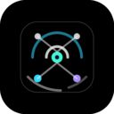
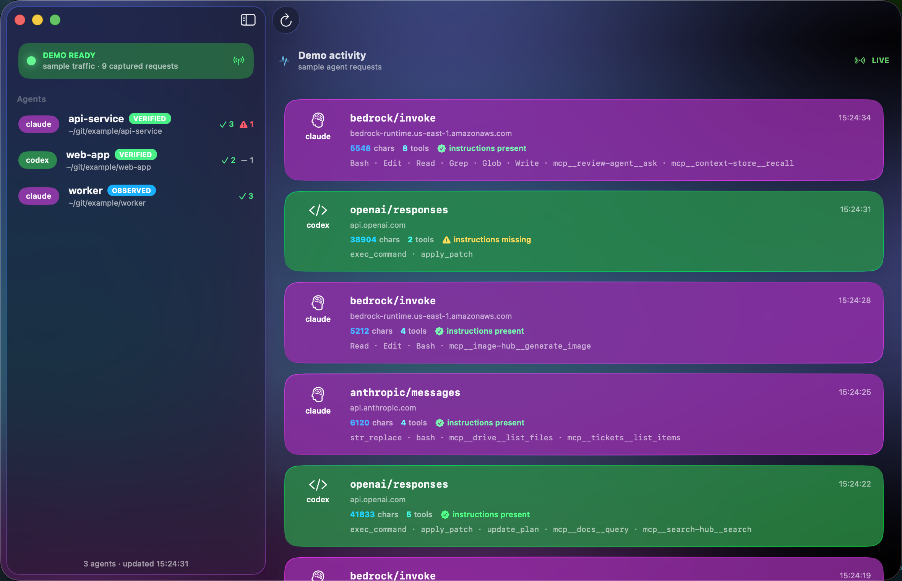
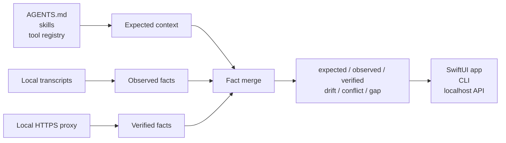
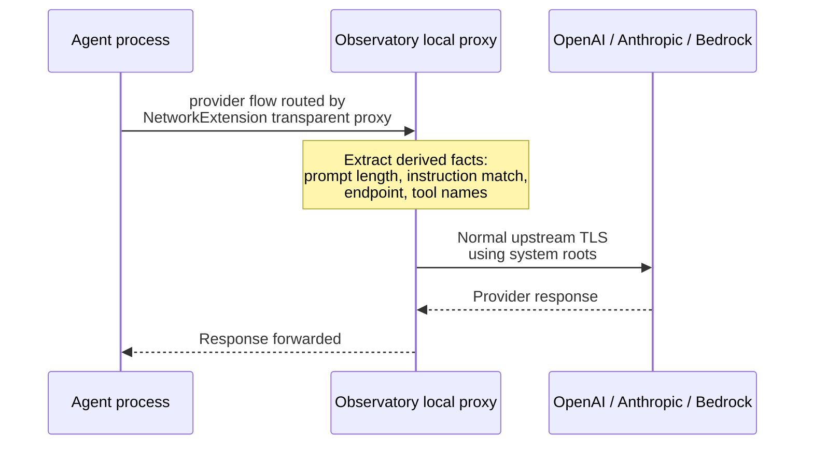

<p align="center">
  
</p>

<h1 align="center">Agent Observatory</h1>

<p align="center">
  <strong>See what your coding agents actually received.</strong>
</p>

<p align="center">
  A local-first macOS observatory for agent instructions, tools, transcript
  evidence, and verified outbound LLM request facts.
</p>

<p align="center">
  
  
  
  
  
  
</p>

<p align="center">
  
</p>

## Try It

The intended first-run experience is the native app:

1. Download `Agent-Observatory-0.1.0-macOS.dmg` from Releases.
2. Open the DMG and drag **Agent Observatory.app** to **Applications**.
3. Open **Agent Observatory.app** from Applications.
4. Start with the built-in demo feed. No account, proxy, or trust setup is
   required to see the product surface.
5. When ready, use the app's onboarding panel to copy the live-capture install
   command. The command uses the helper bundled inside the app, so no separate
   `agents` CLI install is required first.

The native app currently targets the macOS 26 preview because it uses the new
Liquid Glass SwiftUI surface. The release build is ad-hoc signed; a broad public
binary download should be Developer ID signed and notarized first.

### First Open

Until the app is Developer ID signed and notarized, macOS may block the first
launch of a downloaded build. If double-clicking the app is rejected:

1. Open **System Settings** → **Privacy & Security**.
2. Find the blocked **Agent Observatory** message.
3. Click **Open Anyway**, then confirm the launch.

Advanced fallback:

```bash
xattr -dr com.apple.quarantine /Applications/Agent\ Observatory.app
```

No Xcode required for the backend-only smoke test. Requires Go 1.26:

```bash
cd backend
go run ./cmd/agents monitor --demo
```

The command starts the localhost API, live SSE stream, local proxy, and sanitized
demo data. Open the native app later for the full visual surface.

The Go engine and CLI are separate and portable across Go-supported platforms.

## Why This Exists

Coding-agent context is mostly invisible. You usually discover a bad instruction
stack, missing tool, stale skill, or provider mismatch only after the agent makes
a strange decision.

Agent Observatory turns that hidden state into a product surface:

| Before | With Observatory |
| --- | --- |
| "The agent ignored my repo rules." | See whether the expected instructions were present. |
| "Why didn't it use the right tool?" | Compare expected tools against transcript and wire evidence. |
| "The transcript says one thing, the request may say another." | Detect conflicts between observed transcript facts and verified outbound requests. |
| "I need to debug this locally, not upload prompts to another service." | Run a local app and localhost engine with derived-fact persistence only. |

## What It Shows

| Surface | What you get |
| --- | --- |
| **Sessions** | Recent local Claude, Codex, and Antigravity sessions from on-disk transcripts. |
| **Expected context** | Instructions, skills, and tools resolved for each workspace. |
| **Observed evidence** | Facts found in local CLI transcripts. |
| **Verified evidence** | Facts captured from outbound LLM requests through the local proxy. |
| **Drift** | Expected context that was missing from a complete source. |
| **Conflicts** | Transcript and wire evidence disagreeing for the same session/request. |
| **Live feed** | A realtime stream of agent requests as they leave the machine. |

## The Core Idea

Observatory separates what *should* be present from what was actually observed or
verified.



The backend is the source of truth. The app, CLI, and API all render the same
fact-level model.

## Install Paths

### Native App

The public artifact is a DMG:

```bash
open Agent-Observatory-0.1.0-macOS.dmg
```

Drag **Agent Observatory.app** to **Applications**, then open it. The app starts
with demo data. Drag-installing the app does not enable live capture; live
capture is an explicit second step inside onboarding.

The DMG also has a zip fallback for environments where DMGs are inconvenient.
The app bundle contains the `agents` helper either way.

### Live Capture

There are two evidence levels:

| Level | Meaning | Setup |
| --- | --- | --- |
| **Observed** | Read from local CLI transcripts. | Passive; no proxy required. |
| **Verified** | Captured from outbound LLM requests. | One explicit local install. |

Use the onboarding panel to copy the bundled-helper command after you have read
the trust explanation. It installs a local launchd daemon, a stable local CA, and
the proxy/trust environment needed by newly launched agents.

Then use Claude, Codex, and other agents normally. Newly launched agents that
honor standard proxy/trust environment variables route through the local
Observatory proxy automatically.

No wrapper command in the primary flow. No managed launch. No browser extension.
The onboarding panel also exposes the reset command; the equivalent CLI command
is:

```bash
agents uninstall
```

Uninstall reverses the setup and is covered by a looped fake-home QA harness.

### Optional CLI

Power users can install and inspect live capture from the standalone CLI:

```bash
agents install
agents status
agents uninstall
```

For the app release path, onboarding provides fully-qualified commands that
point at the helper bundled inside **Agent Observatory.app**. A separate CLI
install is optional, not required for the GUI path.

## Build From Source

Native app requirements:

- macOS 26+
- Xcode 26+
- XcodeGen
- Go 1.26+

Build the local release artifacts:

```bash
make release
open dist/Agent\ Observatory.app
```

The app opens with a first-run onboarding surface and starts in **Demo** mode so
the live feed is immediately useful before any proxy or trust setup. The
onboarding path lets users explore sample evidence first, then copy the live
capture install command when they are ready. Use the menu bar extra to switch
Demo/Live mode, reopen onboarding, refresh sessions, show the main window, or
quit.

For inner-loop development only:

```bash
make app-build
open /tmp/observatory-dd/Build/Products/Debug/Agent\ Observatory.app
```

### Full Local QA

```bash
make qa
```

This runs backend build, vet, unit tests, race tests, install lifecycle QA, and
the macOS app build.

## Trust Model

This is a local app. The engine binds to `127.0.0.1`; there is no hosted service
and no cloud database.

Yes, verified capture uses a local MITM hop for inspected provider requests.
That explicit local interception is what makes HTTPS body inspection possible.

Capture ingress is a macOS **NetworkExtension transparent proxy** (a signed,
user-approved system extension). The kernel routes only outbound provider flows
to Observatory; all other traffic flows normally **by construction** — there is
no global `HTTPS_PROXY`/`HTTP_PROXY` hijack and unrelated hosts are never
diverted. The extension matches the LLM-provider allowlist by TLS SNI and relays
those flows to the local proxy, which terminates TLS and reads only derived
facts. For agents to accept the local proxy's certificates, Observatory installs
its CA into your **login keychain** (per-user, never the System keychain) at the
moment you approve the system extension; `agents uninstall` (and disabling
capture) removes that trust. A legacy environment-variable proxy path remains
available as a fallback for runtimes the transparent proxy can't route.



Important boundaries:

- Observatory's CA is local to the client-to-proxy leg for inspected hosts.
- The CA is installed into your per-user **login** keychain (behind the system
  extension approval), never the macOS **System** keychain, and is removed on
  uninstall.
- Only allowlisted provider flows are routed to the proxy; unrelated traffic is
  never diverted, so the CA is never exercised against non-provider hosts.
- A stable CA certificate and private key are stored under Observatory's local
  state directory so the ambient daemon can restart without breaking trust.
- Upstream provider TLS still uses normal system trust.
- Raw prompt bodies are not persisted.
- Persisted capture state stores derived facts: prompt length, endpoint, and
  tool names. Instruction matching is computed against your resolved local
  instruction files without storing raw prompt bodies.

## Compatibility

| Surface | Status | Notes |
| --- | --- | --- |
| Claude transcript discovery | Observed | Reads local JSONL transcript context and complete tool catalogs when available. |
| Codex transcript discovery | Observed | Reads local session JSONL; tool evidence is positive-only when only invoked tools are present. |
| Antigravity transcript discovery | Partial | Discovers sessions from history; opaque `.pb` conversation bodies are not parsed. |
| OpenAI chat/responses body shapes | Verified parser coverage | Covered by backend proxy parser tests. |
| Anthropic Messages body shape | Verified parser coverage | Covered by native Anthropic proxy-path test. |
| Bedrock Anthropic body shape | Verified parser coverage | Covered by backend proxy parser tests. |
| Install-once ambient capture | Local QA | Install/status/uninstall are covered by repeated fake-home lifecycle tests. |

## Commands

| Command | Purpose |
| --- | --- |
| `agents install` | Install ambient capture: daemon, local CA path, and process env. |
| `agents status` | Show installed, partial, or absent setup state. |
| `agents uninstall` | Fully reverse the install. |
| `agents serve` | Run the localhost JSON API only (default subcommand; no proxy). |
| `agents monitor --demo` | Run the API, SSE stream, proxy, and sample feed. |
| `agents sessions --limit 20` | Print recent sessions and evidence marks. |
| `agents context explain /path/to/project` | Show resolved context for a workspace. |
| `agents doctor wire` | Report verified-capture capability per runtime. |

## Release Artifacts

```bash
make release
```

Artifacts are written to `dist/`:

- `Agent-Observatory-0.1.0-macOS.dmg`
- `Agent-Observatory-0.1.0-macOS.zip`
- `Agent Observatory.app`
- `agents`
- `SHA256SUMS`

The DMG is the primary user-facing artifact. It contains
**Agent Observatory.app** and an **Applications** symlink for the normal macOS
drag-install flow. The zip is a fallback.

The local release build is ad-hoc signed. A broad public binary download should
be Developer ID signed and notarized first.

## Current Limitations

- macOS 26 and Xcode 26 are required for the native Liquid Glass app.
- Verified capture requires explicit proxy/trust setup.
- Antigravity transcript contents are discovery-only when stored in opaque `.pb`
  files.
- This release observes context. It does not yet manage canonical context
  upstream for every agent runtime.

## Roadmap

| Next | Why it matters |
| --- | --- |
| Signed and notarized macOS release | Makes public binary distribution low-friction. |
| Short demo clip | Helps people understand the live feed before cloning. |
| Broader runtime notes | Clarifies install-once capture behavior across agent stacks. |
| Canonical context management | Turns the observatory into the control plane after observability proves demand. |

## Development

```bash
make backend-qa
make app-build
make release
bash scripts/release-qa.sh
```

Detailed release and planning notes live under `docs/`.
