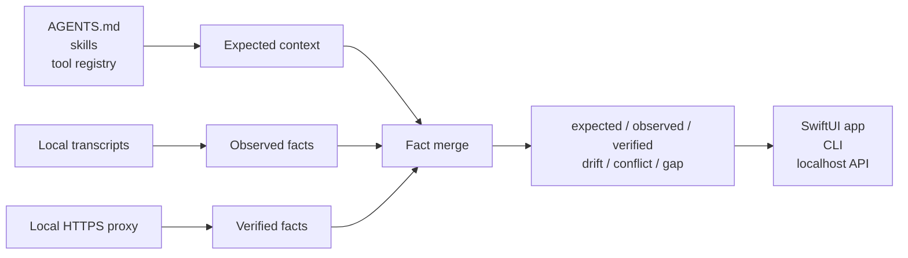
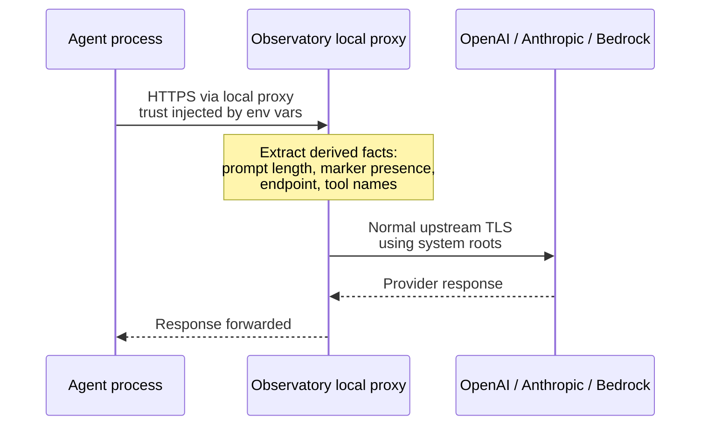

<p align="center">
  
</p>

<h1 align="center">Agent Context Observatory</h1>

<p align="center">
  <strong>See what your coding agents actually received.</strong>
</p>

<p align="center">
  A local-first macOS observatory for agent instructions, tools, transcript
  evidence, and verified outbound LLM request facts.
</p>

<p align="center">
  
  
  
  
  
</p>

<p align="center">
  
</p>

## Try It Now

No Xcode required for the backend smoke test. Requires Go 1.26:

```bash
cd backend
go run ./cmd/agents monitor --demo
```

The command starts the localhost API, live SSE stream, local proxy, and sanitized
demo data. Open the native app later for the full visual surface.

The native app currently targets the macOS 26 preview because it uses the new
Liquid Glass SwiftUI surface. The Go engine and CLI are separate and portable
across Go-supported platforms.

## Why This Exists

Coding-agent context is mostly invisible. You usually discover a bad instruction
stack, missing tool, stale skill, or provider mismatch only after the agent makes
a strange decision.

Agent Context Observatory turns that hidden state into a product surface:

| Before | With Observatory |
| --- | --- |
| "The agent ignored my repo rules." | See whether the expected instructions were present. |
| "Why didn't it use the right tool?" | Compare expected tools against transcript and wire evidence. |
| "The transcript says one thing, the request may say another." | Detect conflicts between observed transcript facts and verified outbound requests. |
| "I need to debug this locally, not upload prompts to another service." | Run a local app and localhost engine with derived-fact persistence only. |

## What It Shows

| Surface | What you get |
| --- | --- |
| **Sessions** | Recent local Claude, Codex, and Antigravity sessions from on-disk transcripts. |
| **Expected context** | Instructions, skills, and tools resolved for each workspace. |
| **Observed evidence** | Facts found in local CLI transcripts. |
| **Verified evidence** | Facts captured from outbound LLM requests through the local proxy. |
| **Drift** | Expected context that was missing from a complete source. |
| **Conflicts** | Transcript and wire evidence disagreeing for the same session/request. |
| **Live feed** | A realtime stream of agent requests as they leave the machine. |

## The Core Idea

Observatory separates what *should* be present from what was actually observed or
verified.



The backend is the source of truth. The app, CLI, and API all render the same
fact-level model.

## Quick Start

### Native App

Native app requirements:

- macOS 26+
- Xcode 26+
- XcodeGen
- Go 1.26+

Build and open the app:

```bash
make app-build
open /tmp/observatory-dd/Build/Products/Debug/Observatory.app
```

The app starts in **Demo** mode so the live feed is immediately useful. Use the
menu bar extra to switch Demo/Live mode, refresh sessions, show the main window,
or quit.

### Full Local QA

```bash
make qa
```

This runs backend build, vet, unit tests, race tests, install lifecycle QA, and
the macOS app build.

## Real Capture

There are two evidence levels:

| Level | Meaning | Setup |
| --- | --- | --- |
| **Observed** | Read from local CLI transcripts. | Passive; no proxy required. |
| **Verified** | Captured from outbound LLM requests. | One explicit local install. |

Install once:

```bash
agents install
agents status
```

Then use Claude, Codex, and other agents normally. Newly launched agents route
through the local Observatory proxy automatically.

No wrapper command. No managed launch. No browser extension. No hosted account.

Remove everything:

```bash
agents uninstall
```

Install sets a local launchd daemon, a stable local CA, and the process
environment needed by newly launched agents. Uninstall reverses the setup and is
covered by a looped fake-home QA harness.

## Trust Model

This is a local app. The engine binds to `127.0.0.1`; there is no hosted service
and no cloud database.

Yes, verified capture uses a local MITM hop between the agent process and
Observatory. That explicit local interception is what makes HTTPS body
inspection possible.



Important boundaries:

- Observatory's CA is local to the agent-to-proxy leg.
- The CA is not installed into the macOS System keychain.
- Upstream provider TLS still uses normal system trust.
- Raw prompt bodies are not persisted.
- Persisted capture state stores derived facts: prompt length, marker presence,
  endpoint, and tool names.

## Compatibility

| Surface | Status | Notes |
| --- | --- | --- |
| Claude transcript discovery | Observed | Reads local JSONL transcript context and complete tool catalogs when available. |
| Codex transcript discovery | Observed | Reads local session JSONL; tool evidence is positive-only when only invoked tools are present. |
| Antigravity transcript discovery | Partial | Discovers sessions from history; opaque `.pb` conversation bodies are not parsed. |
| OpenAI chat/responses body shapes | Verified parser coverage | Covered by backend proxy parser tests. |
| Anthropic Messages body shape | Verified parser coverage | Covered by native Anthropic proxy-path test. |
| Bedrock Anthropic body shape | Verified parser coverage | Covered by backend proxy parser tests. |
| Install-once ambient capture | Local QA | Install/status/uninstall are covered by repeated fake-home lifecycle tests. |

## Commands

| Command | Purpose |
| --- | --- |
| `agents install` | Install ambient capture: daemon, local CA path, and process env. |
| `agents status` | Show installed, partial, or absent setup state. |
| `agents uninstall` | Fully reverse the install. |
| `agents monitor --demo` | Run the API, SSE stream, proxy, and sample feed. |
| `agents sessions --limit 20` | Print recent sessions and evidence marks. |
| `agents context explain /path/to/project` | Show resolved context for a workspace. |
| `agents doctor wire` | Report verified-capture capability per runtime. |

## Release Artifacts

```bash
make release
```

Artifacts are written to `dist/`:

- `Agent-Context-Observatory-0.1.0-macos.zip`
- `agents`
- `SHA256SUMS`

The local release build is ad-hoc signed. A broad public binary download should
be Developer ID signed and notarized first.

## Current Limitations

- macOS 26 and Xcode 26 are required for the native Liquid Glass app.
- Verified capture requires explicit proxy/trust setup.
- Antigravity transcript contents are discovery-only when stored in opaque `.pb`
  files.
- GitHub Actions are pending until the publishing token can create workflows.
- This release observes context. It does not yet manage canonical context
  upstream for every agent runtime.

## Roadmap

| Next | Why it matters |
| --- | --- |
| Signed and notarized macOS release | Makes public binary distribution low-friction. |
| GitHub CI | Gives every public commit a visible build/test signal. |
| Short demo clip | Helps people understand the live feed before cloning. |
| Broader runtime notes | Clarifies install-once capture behavior across agent stacks. |
| Canonical context management | Turns the observatory into the control plane after observability proves demand. |

## Development

```bash
make backend-qa
make app-build
make release
```

Detailed release and planning notes live under `docs/`.
