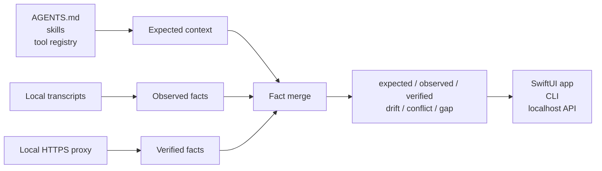
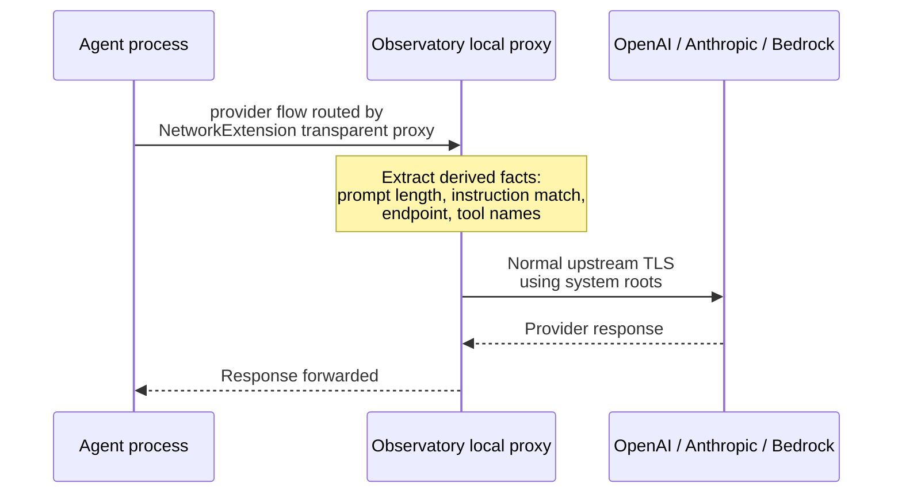

<p align="center">
  
</p>

<h1 align="center">Agent Observatory</h1>

<p align="center">
  <strong>See what your coding agents actually received.</strong>
</p>

<p align="center">
  A local-first macOS observatory for agent instructions, tools, transcript
  evidence, and verified outbound LLM request facts.
</p>

<p align="center">
  
  
  
  
  
  
</p>

<p align="center">
  
</p>

## Try It

The intended first-run experience is the native app:

1. Download `Agent-Observatory-0.2.0-macOS.dmg` from Releases.
2. Open the DMG and drag **Agent Observatory.app** to **Applications**.
3. Open **Agent Observatory.app** from Applications.
4. Start with the built-in demo feed. No account, proxy, or trust setup is
   required to see the product surface.
5. When ready, use the app's onboarding panel to turn on live capture. The app
   walks through the local engine install, macOS NetworkExtension approval, and
   login-keychain trust step.

The native app currently targets the macOS 26 preview because it uses the new
Liquid Glass SwiftUI surface. Public release artifacts are Developer ID signed,
hardened-runtime, notarized, stapled, and checked by `make release-qa` before
publication.

### Enabling live capture

Live capture has two explicit steps: install the local engine, then enable the
macOS **system extension** (NetworkExtension transparent proxy). On first enable,
macOS asks you to approve Agent Observatory in **System Settings → General →
Login Items & Extensions → Network Extensions**, then the app trusts the local CA
in your login keychain. Approve both, restart any already-running agent shells,
and newly launched Claude/Codex sessions are captured normally. (System
extensions only activate from **/Applications**, so install the app there first.)

No Xcode required for the backend-only smoke test. Requires Go 1.26:

```bash
cd backend
go run ./cmd/agents monitor --demo
```

The command starts the localhost API, live SSE stream, local proxy, and sanitized
demo data. Open the native app later for the full visual surface.

The Go engine and CLI are separate and portable across Go-supported platforms.

## Why This Exists

Coding-agent context is mostly invisible. You usually discover a bad instruction
stack, missing tool, stale skill, or provider mismatch only after the agent makes
a strange decision.

Agent Observatory turns that hidden state into a product surface:

| Before | With Observatory |
| --- | --- |
| "The agent ignored my repo rules." | See whether the expected instructions were present. |
| "Why didn't it use the right tool?" | Compare expected tools against transcript and wire evidence. |
| "The transcript says one thing, the request may say another." | Detect conflicts between observed transcript facts and verified outbound requests. |
| "I need to debug this locally, not upload prompts to another service." | Run a local app and localhost engine with derived-fact persistence only. |

## What It Shows

| Surface | What you get |
| --- | --- |
| **Sessions** | Recent local Claude, Codex, and Antigravity sessions from on-disk transcripts. |
| **Expected context** | Instructions, skills, and tools resolved for each workspace. |
| **Observed evidence** | Facts found in local CLI transcripts. |
| **Verified evidence** | Facts captured from outbound LLM requests through the local proxy. |
| **Drift** | Expected context that was missing from a complete source. |
| **Conflicts** | Transcript and wire evidence disagreeing for the same session/request. |
| **Live feed** | A realtime stream of agent requests as they leave the machine. |

## The Core Idea

Observatory separates what *should* be present from what was actually observed or
verified.



The backend is the source of truth. The app, CLI, and API all render the same
fact-level model.

## Install Paths

### Native App

The public artifact is a DMG:

```bash
open Agent-Observatory-0.2.0-macOS.dmg
```

Drag **Agent Observatory.app** to **Applications**, then open it. The app starts
with demo data. Drag-installing the app does not enable live capture; live
capture is an explicit second step inside onboarding.

The DMG also has a zip fallback for environments where DMGs are inconvenient.
The app bundle contains the `agents` helper either way.

### Live Capture

There are two evidence levels:

| Level | Meaning | Setup |
| --- | --- | --- |
| **Observed** | Read from local CLI transcripts. | Passive; no proxy required. |
| **Verified** | Captured from outbound LLM requests. | One explicit local install. |

Use the onboarding panel to enable live capture after you have read the trust
explanation. It installs a local launchd daemon and a stable local CA, trusts
that CA in your **login keychain**, and enables a **NetworkExtension transparent
proxy** that routes only allowlisted LLM-provider flows to the local proxy.

Then use Claude, Codex, and other agents normally. The system extension diverts
only provider traffic to Observatory; everything else is untouched. There is no
global `HTTPS_PROXY` hijack. The only env vars the install sets are the *additive*
`NODE_EXTRA_CA_CERTS` (Node/Claude Code) and `CODEX_CA_CERTIFICATE` (Codex) —
because those runtimes don't read the macOS keychain. Both only *add* Observatory's
CA without replacing the system roots; Bedrock via the AWS Go SDK reads the
keychain directly and needs nothing.

No wrapper command in the primary flow. No managed launch. No browser extension.
The onboarding panel also exposes the reset command; the equivalent CLI command
is:

```bash
agents uninstall
```

Uninstall reverses the setup and is covered by a looped fake-home QA harness.

### Optional CLI

Power users can install and inspect live capture from the standalone CLI:

```bash
agents install
agents status
agents uninstall
```

For the app release path, onboarding provides fully-qualified commands that
point at the helper bundled inside **Agent Observatory.app**. A separate CLI
install is optional, not required for the GUI path.

## Build From Source

Native app requirements:

- macOS 26+
- Xcode 26+
- XcodeGen
- Go 1.26+

Build the local release artifacts:

```bash
make release
open dist/Agent\ Observatory.app
```

The app opens with a first-run onboarding surface and starts in **Demo** mode so
the live feed is immediately useful before any proxy or trust setup. The
onboarding path lets users explore sample evidence first, then copy the live
capture install command when they are ready. Use the menu bar extra to switch
Demo/Live mode, reopen onboarding, refresh sessions, show the main window, or
quit.

For inner-loop development only:

```bash
make app-build
open /tmp/observatory-dd/Build/Products/Debug/Agent\ Observatory.app
```

### Full Local QA

```bash
make qa
```

This runs backend build, vet, unit tests, race tests, install lifecycle QA, and
the macOS app build.

## Trust Model

This is a local app. The engine binds to `127.0.0.1`; there is no hosted service
and no cloud database.

Yes, verified capture uses a local MITM hop for inspected provider requests.
That explicit local interception is what makes HTTPS body inspection possible.

Capture ingress is a macOS **NetworkExtension transparent proxy** (a signed,
user-approved system extension). To inspect by hostname, the extension's kernel
rule takes **all outbound TCP :443 flows** into the (local, user-space) system
extension, peeks the TLS ClientHello SNI, and then:

- **allowlisted provider SNI** → relays the flow to the local proxy, which
  terminates TLS and parses the request; or
- **anything else** → **immediately direct-relays** to the real destination with
  **no TLS termination and nothing persisted** — the flow is untouched in every
  way that matters (its bytes are copied through; we never see plaintext).

So there is no global `HTTPS_PROXY`/`HTTP_PROXY` hijack, and only provider flows
are ever decrypted. (Loopback/RFC1918 are excluded at the kernel rule; UDP/QUIC
is never taken.) For agents to accept the local proxy's certificates, Observatory
installs its CA into your **login keychain** (per-user, never the System
keychain) at the moment you approve the system extension; `agents uninstall` (and
disabling capture) removes that trust.

Honest caveats on trust — runtimes resolve roots differently, so a single
keychain root isn't enough:

- **Claude Code (Node/Bun)** doesn't read the macOS keychain by default → the
  install sets the *additive* `NODE_EXTRA_CA_CERTS`.
- **Codex CLI** talks over WebSockets (`wss://…/responses`), which can't be
  usefully inspected. Observatory replies `426 Upgrade Required` to that upgrade,
  which Codex maps to an instant HTTP fallback on the same endpoint — and the
  HTTP request *is* fully captured. For that HTTP path's trust, the install sets
  the *additive* `CODEX_CA_CERTIFICATE` (Codex's own custom-CA var), since Codex
  uses rustls/native-tls rather than the macOS keychain.
- **Bedrock via the AWS Go SDK** reads the login keychain directly → no env var.

Both env vars only *add* Observatory's CA; they never replace the system roots,
so unrelated HTTPS is unaffected. The install sets **no** `HTTPS_PROXY`/
`HTTP_PROXY` and **no** root-replacing `SSL_CERT_FILE`/`AWS_CA_BUNDLE`: routing is
the extension's job. Caveat: env vars only reach **newly launched** agents — a
shell or agent already running when you enable capture won't trust the CA (and
will fail provider TLS) until restarted.



Important boundaries:

- Observatory's CA is local to the client-to-proxy leg for inspected hosts.
- The CA is installed into your per-user **login** keychain (behind the system
  extension approval), never the macOS **System** keychain, and is removed on
  uninstall.
- Only allowlisted provider flows are ever TLS-terminated; non-provider :443
  flows are direct-relayed after the SNI peek, so the CA is never exercised
  against — and the proxy never sees plaintext for — non-provider hosts.
- A stable CA certificate and private key are stored under Observatory's local
  state directory (`0600` key, per-user) so the ambient daemon can restart
  without breaking trust. Any process running as you could read that key while
  capture is installed — a same-user local risk, removed by `agents uninstall`.
- Upstream provider TLS still uses normal system trust.
- **In memory**, the proxy parses the request body (up to an 8 MiB cap — larger
  bodies are forwarded unparsed) and keeps a bounded ring (most-recent 500
  captures) of the assembled prompt + tool text to drive the live feed and
  instruction matching. **On disk**, only *derived facts* are persisted — prompt
  length, endpoint, tool names — never raw prompt bodies. Instruction matching is
  computed against your resolved local instruction files.

## Compatibility

| Surface | Status | Notes |
| --- | --- | --- |
| Claude transcript discovery | Observed | Reads local JSONL transcript context and complete tool catalogs when available. |
| Codex transcript discovery | Observed | Reads local session JSONL; tool evidence is positive-only when only invoked tools are present. |
| Antigravity transcript discovery | Partial | Discovers sessions from history; opaque `.pb` conversation bodies are not parsed. |
| OpenAI chat/responses body shapes | Verified parser coverage | Covered by backend proxy parser tests. |
| Anthropic Messages body shape | Verified parser coverage | Covered by native Anthropic proxy-path test. |
| Bedrock Anthropic body shape | Verified parser coverage | Covered by backend proxy parser tests. |
| Install-once ambient capture | Local QA | Install/status/uninstall are covered by repeated fake-home lifecycle tests. |

## Commands

| Command | Purpose |
| --- | --- |
| `agents install` | Install ambient capture: proxy daemon, stable local CA, and additive per-runtime CA env (`NODE_EXTRA_CA_CERTS`, `CODEX_CA_CERTIFICATE`). |
| `agents trust install` | Trust the local CA in your login keychain (run behind the approved extension). |
| `agents status` | Show installed, partial, or absent setup state. |
| `agents uninstall` | Fully reverse the install. |
| `agents serve` | Run the localhost JSON API only (default subcommand; no proxy). |
| `agents monitor --demo` | Run the API, SSE stream, proxy, and sample feed. |
| `agents sessions --limit 20` | Print recent sessions and evidence marks. |
| `agents context explain /path/to/project` | Show resolved context for a workspace. |
| `agents doctor wire` | Report verified-capture capability per runtime. |

## Release Artifacts

```bash
make release
```

Artifacts are written to `dist/`:

- `Agent-Observatory-0.2.0-macOS.dmg`
- `Agent-Observatory-0.2.0-macOS.zip`
- `Agent Observatory.app`
- `agents`
- `SHA256SUMS`

`make release` is intentionally **headless**: it builds the signed app, zip,
DMG, and checksums without running Finder AppleScript, so it does not steal GUI
focus during local QA. The DMG is functional but plain by default. If you
explicitly want Finder window background/icon positioning, run:

```bash
DMG_STYLE=polished make release-polished
```

That polished path uses Finder layout metadata and can bring a Finder window to
the foreground.

For public distribution, notarize and staple the app and DMG after `make release`:

```bash
NOTARY_PROFILE=<notarytool-keychain-profile> make notarize
make release-qa
make v02-readiness
```

The final interactive release gates are grouped behind an explicit helper:

```bash
make v02-finalize                         # read-only status
scripts/v02-finalize.sh --trust           # may prompt for login-keychain trust
NOTARY_PROFILE=<profile> scripts/v02-finalize.sh --notarize
CONFIRM_PUBLISH_V02=1 scripts/v02-finalize.sh --publish
```

The DMG is the primary user-facing artifact. It contains
**Agent Observatory.app** and an **Applications** symlink for the normal macOS
drag-install flow. The zip is a fallback. A build is publication-ready only
after `make release-qa` passes against the stapled app and DMG.

Security notes for the local CA, prompt-data handling, and vulnerability reports
are in [SECURITY.md](SECURITY.md).

## Current Limitations

Capture mechanism:

- **HTTP/3 (QUIC) is not captured.** The extension takes TCP :443 only; provider
  HTTP/3 falls back to TCP in practice, but a QUIC-only client would be missed.
- **ECH / no-SNI flows fail open.** If a provider enables Encrypted ClientHello,
  the SNI is unreadable and the flow is direct-relayed (not captured), never
  broken.
- **Inspected hosts are proxied over HTTP/1.1.** Mainstream provider SDKs accept
  this; a hypothetical HTTP/2-only client is unsupported on the inspected path.
- The SNI peek reassembles across TCP segments but assumes a single-record
  ClientHello; an unusually large multi-record hello fails open (not captured).

Per-runtime CA trust (`NODE_EXTRA_CA_CERTS`, `CODEX_CA_CERTIFICATE`):

- It's additive trust, not routing — and it only helps **newly launched**
  processes that inherit the env. Already-running shells/agents must restart, or
  they'll fail provider TLS with an untrusted-issuer error while capture is on.
- **Node/Bun (Claude Code):** a client that passes an explicit `ca:` option,
  sanitizes its env, or embeds its own runtime won't pick up
  `NODE_EXTRA_CA_CERTS`. Bun honors only its own CA store for some operations.
- **Codex CLI:** its primary `wss://…/responses` transport can't be inspected, so
  the proxy replies `426` and Codex falls back to its HTTP endpoint (which *is*
  captured). HTTP-path trust uses the additive `CODEX_CA_CERTIFICATE` (Codex uses
  rustls/native-tls, not the keychain). Verified against codex 0.134.x. Other
  provider WebSockets with no HTTP fallback (e.g. OpenAI Realtime `/v1/realtime`)
  are relayed untouched, not captured — so they keep working.
- **Bedrock (AWS Go SDK):** reads the login keychain directly, needs no env.
- These vars add a trusted root for inheriting processes; removed by
  `agents uninstall`.

Scope:

- macOS 26 and Xcode 26 are required for the native Liquid Glass app.
- Verified capture requires the system-extension approval + login-keychain trust.
- Antigravity transcript contents are discovery-only when stored in opaque `.pb`
  files.
- This release observes context. It does not yet manage canonical context
  upstream for every agent runtime.

## Roadmap

| Next | Why it matters |
| --- | --- |
| Short demo clip | Helps people understand the live feed before cloning. |
| Broader runtime notes | Clarifies install-once capture behavior across agent stacks. |
| HTTP/3 + multi-record SNI capture | Closes the remaining capture-coverage gaps. |
| Canonical context management | Turns the observatory into the control plane after observability proves demand. |

## Development

```bash
make backend-qa
make app-build
make release
make release-layout-qa
NOTARY_PROFILE=<notarytool-keychain-profile> make notarize
make release-qa
```

Detailed release and planning notes live under `docs/`, including
[`docs/v0.2-readiness.md`](docs/v0.2-readiness.md),
[`docs/ne-reset-runbook.md`](docs/ne-reset-runbook.md),
[`docs/release-publication-runbook.md`](docs/release-publication-runbook.md),
and [`docs/release-v0.2-draft.md`](docs/release-v0.2-draft.md).
